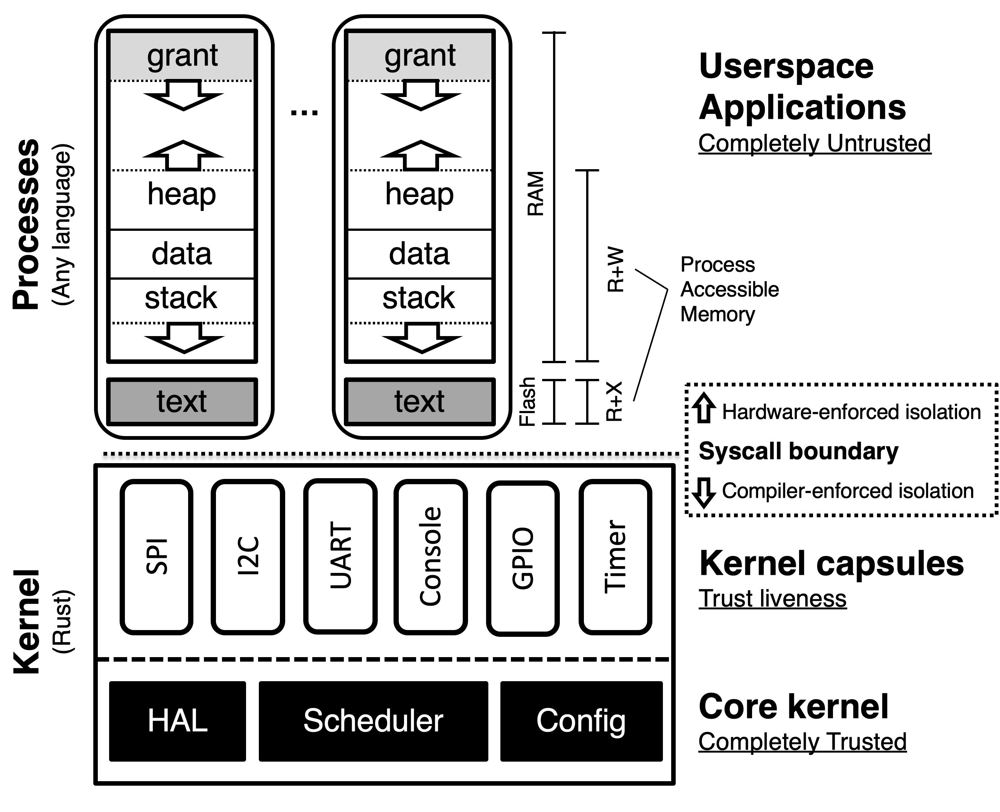

# Tock OS Course Part 1: Getting your environment set up

The goal of this part of the course is to make sure you have a working
development environment for Tock.

During this you will:

- Get a high-level overview of how Tock works.
- Learn how to compile and flash the kernel onto a Hail board.

## 1. Presentation: Tock's goals, architecture and components (10 min)

The key contribution of Tock is that it uses Rust's borrow checker as a
language sandbox for isolation and a cooperative scheduling model for
concurrency in the kernel.  As a result, isolation is (more or less) free in
terms of resource consumption at the expense of preemptive scheduling (so a
malicious component could block the system by, e.g., spinning in an infinite
loop). This is accomplished by the following architecture:

Tock includes three architectural components. A small trusted kernel, written
in Rust, implements a hardware abstraction layer (HAL), scheduler and
platform-specific configuration. Other system components are implemented in one
of two protection mechanisms: capsules, which are compiled with the kernel and
use Rust’s type and module systems for safety, and processes, which use the MPU
for protection at runtime.

Read the Tock documentation for more details on its
[design](https://www.tockos.org/documentation/design).

## 2. Check your understanding (10 min)

1. What kinds of binaries exist on a Tock board? Hint: There are three, and
   only two can be programmed using `tockloader`.

2. What are the differences between capsules and processes? What performance
   and memory overhead does each entail? Why would you choose to write
   something as a process instead of a capsule and vice versa?

## 3. Compile and flash the kernel (10 min)

# Build the kernel

To build the kernel, just type make in the root directory, or in boards/hail/.

        $ cd boards/hail/
        $ make

If this is the first time you are trying to make the kernel, cargo and rustup
will now go ahead and install all the requirements of Tock.

The root Makefile selects a board and architecture to build the kernel for and
routes all calls to that board's specific Makefile. It's set up with
`TOCK_BOARD ?= hail`, so it compiles for the Hail board by default. To compile
for a different board, just change the `TOCK_BOARD` environment variable. For
  example, to compile for the imix instead, use `export TOCK_BOARD=imix`.

# Connect to a Hail board

To connect your development machine to the Hail, connect them with a micro-USB
cable. Any cable will do. Hail should come with the Tock kernel and the Hail
test app pre-loaded. When you plug in Hail, the blue LED should blink slowly
(about once per second). Pressing the User Button—just to the right of the USB
plug—should turn on the green LED.

The Hail board should appear as a regular serial device (e.g.
/dev/tty.usbserial-c098e5130006 on my machine). While you can connect with any
standard serial program (set to 115200 baud), tockloader makes this easier.
Tockloader can read attributes from connected serial devices, and will
automatically find your connected Hail. Simply run:

        $ tockloader listen
        No device name specified. Using default "tock"
        Using "/dev/ttyUSB0 - Hail IoT Module - TockOS"

        Listening for serial output.

        [Hail] Test App!
        [Hail] Samples all sensors.
        [Hail] Transmits name over BLE.
        [Hail] Button controls LED.
        [Hail Sensor Reading]
          Temperature:  3174 1/100 degrees C
          Humidity:     3915 0.01%
          Light:        15
          Acceleration: 987
        ...

# Flash the kernel

Now that the Hail board is connected and you have verified that the kernel
compiles, we can flash the Hail board with the latest Tock kernel:

        $ make program

This command will compile the kernel if needed, and then use `tockloader` to
flash it onto the Hail. When the flash command succeeds, the Hail test app
should no longer be working (i.e. the blue LED will not be blinking). Instead,
the red LED will be blinking furiously, a sign that the kernel has panicked.
Don't panic! This is because:

# Clear out the applications and re-flash the test app.

The Tock Binary Format (TBF) was recently changed, and is incompatible with the
app pre-loaded on the Hail board. To fix this, clear it out and re-flash it.

        $ tockloader list
        ...
        [App 0]
          Name:                  hail
          Total Size in Flash:   65536 bytes
        ...

As you can see, the old Hail test app is still installed on the board. This
also nicely demonstrates that user applications are nicely isolated from the
kernel: it is possible to update one independently of the other. Remove it with
the following command:

        $ tockloader uninstall hail

The red LED should no longer be blinking. Now compile and re-flash the Hail
test app:

        $ cd userland/examples/tests/hail/
        $ make program

You now have the bleeding-edge Tock kernel running on your Hail board!

## 4. Customize, compile and flash the `ble-env-sense` service (10 min)

## 5. (Optional) Familiarize yourself with `tockloader` commands (10 min)
